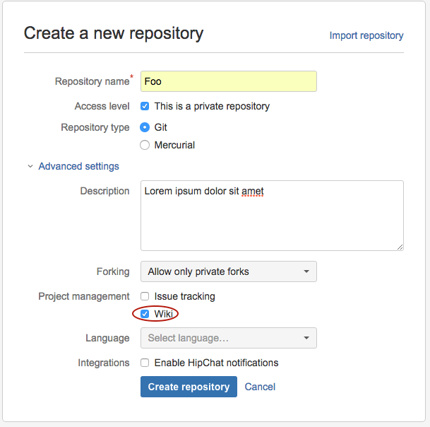
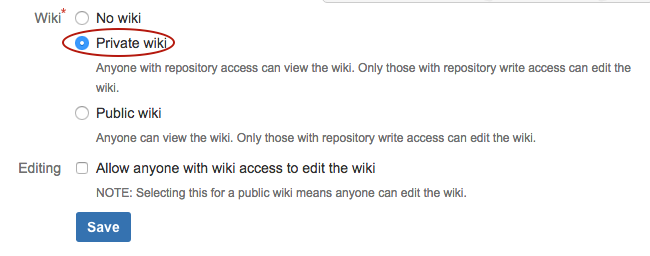
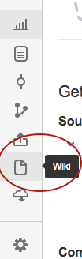
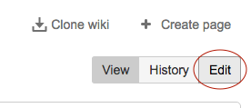

A _Game Design Document_ (GDD) is meant to detail the objective, mechanics, level design, technical requirements, and development milestones for your game. It is a _living document_. You should be consistently updating your design document throughout development. If you are not updating your design document at least twice a week (for your final project), then you are falling behind!

Having a completed design document makes it much easier to visualize your progress throughout development and keep track of what you have accomplished. It will help you make the correct decisions if you need to cut features because you are behind schedule or add features because you are ahead of schedule. Whenever you decide to change some aspect of your game's design or development schedule, make sure to update your design document!

# Your first Game Design Document

To get practice, you may find it helpful to write a Game Design Document for one of the tutorials!

> [action]
> If you would like to, choose one of the tutorials you have completed -- as a reminder, they are:
>
1. Conway's Game of Life in 3D!
1. Outbreak (Breakout)
1. Gem Hunter
1. Marble Maze
1. Playing with Fire
1. Material things
1. Bowling
1. Draft (Drift)
1. Toss
1. Teleportation
1. Tanks
1. Drone Hunt
>
Try and choose something similar to the one you want to make yourself! If you want to make a constant-runner, choose Draft. If you want to make a grid-based game/puzzler, choose Outbreak. Choose Material Things or Playing With Fire if you want to make a VR experience that may not have a primary objective. If none of the tutorials match well with what you'd like to make, pick one that appeals to you.
>
> Log into [BitBucket](http://bitbucket.org) and create a new repository titled after the tutorial. You can use your completed game repository if you have been using one already!
>
> If you're creating a new repository, expand the "Advanced settings" and check the Wiki checkbox:
>
> 
>
> If you're working from an existing repository, click the settings gear on the left, select Wiki settings and make sure that you have a wiki checkbox checked.
>
> 
>
> Then select the Wiki icon on the left:
>
> 
>
> and click "Edit" in the top right:
>
> 
>
> and paste this into the text field in place of what's there:
>
```
[TOC]
>
---
>
### Game Design
>
#### Objective
[explain the goal of the game]
>
#### Gameplay Mechanics
[detail the game mechanics, do not include anything about theme/artwork]
>
#### Level Design
[describe what a typical level or puzzle would look like]
>
[Back to top ^](#)
>
---
>
### Technical
>
#### Scenes
* [list the different scenes/screens used in the game]
>
#### Controls/Input
[describe the control scheme used in the game]
>
#### Components/Non-Component Scripts
* Components
  * [list Components needed and some basic information about required implementation]
* Non-Component Scripts
  * [list Non-Component Script files you will need to create]
>
[Back to top ^](#)
>
---
>
### MVP Milestones
[The overall milestones of first playable build, core gameplay, and polish are just suggestions, plan to finish earlier if possible. The last 20% of work tends to take about as much time as the first 80% so do not slack off on your milestones!]
>
#### Day 1, Part 1
_planing your game_
* [goals for the first half of the day]
>
#### Day 1, Part 2
_finishing a playable build_
* [goals for the second half of the day, should be finishing a playable game]
>
#### Day 2, Part 1
* [goals for the 1st half of the day]
>
#### Day 2, Part 2
* [goals for the 2nd half of the day, should be finishing all core gameplay]
>
#### Day 3, Part 1
_starting the polish_
* [goals for the 1st half of the day]
>
#### Day 3, Part 2
* [goals for the 2nd half of the day, should be finishing the polish]
>
[Back to top ^](#)
```

Time to start writing your GDD!

# Game Design

## Objective

Explain the goal of your game in 2-3 sentences.

## Gameplay Mechanics

This is where you explain your game's core loop(s), whether your game is real time or turn based, single player or multiplayer, social or not, and any key aspects of your gameplay - this could be anything from your power-up system to special enemy types to the ability to rewind time.

## Level Design

Here you need to think about what principles you will follow when designing a level. Describe what a typical level will look like but also list any constraints your game's design will place on the levels. For example, you may decide that every level will have a section where the player cannot mess up, or you may want to note that levels in your game should designed so no backtracking is necessary.

If you game is auto-generated, use this space to describe how difficulty will increase over time.

# Technical

## Scenes

Describe each screen in your game, from the main menu to the gameplay screen to your high score screen and anything in between. Are there any screens you could remove from your MVP? For example, what if there was no main menu and players started immediately at the gameplay? Mark this nice to have screens with "(after MVP)".

As you paper prototype your game and progress through iterations, be sure to add pictures and screenshots here!

## Controls

How will the player interact with the game.

# Minimum Viable Product Milestones

This is the section that should get updated the most often. You will be keeping track of what tasks you plan on completing each week. If you're new to projects this long, you will have to make best guesses as to how long things will take.

Before ordering your tasks on a week by week basis, first list every task on your plate. This should include everything you've listed in your GDD that will be in your MVP and all the non-technical work your game requires.

For every task, estimate how many days it will take. If you think it will take less than a day, round up to a day.

Add all the days together. Multiply by 1.2 to give yourself buffer time for unexpected delays. If you end up with more than 25 days of estimated tasks, do not change your estimates. Unless you have significant experience with large projects you should almost never change your estimates to be more optimistic. It is a big red flag if your gut tells you a task will take N days but after thinking about it you decide it won't take as long. You're almost always wrong.

If you have more than 25 days of work left, cut features. If it doesn't hurt, you aren't cutting enough features.

Revise your design document if necessary if you end up making significant changes to your game's design.

Only once you have a list of tasks that fit in 25 days should you start dividing them up week by week.

# Wrapping Up

Read your design document over to make sure everything makes sense. Check dependencies -- tasks should be in order of completion!

Edit as necessary. Ready to create one for your actual game?
